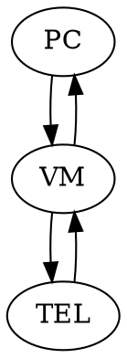
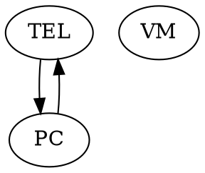

Téléphonie sur IP

## 1 : Prise en main du logiciel avec lecture de l'article GLMF
- paramètres de sip.conf
- paramètres de extension.conf
- création d'abonnés
- principe du forçage du choix des codecs

```bash=
root@debian:~# systemctl start asterisk
root@debian:~# asterisk -cvvvv
debian*CLI> 
```

grace a cette commande on lance asterisk en mode "verbeux" avec un processus CLI


### paramètres de sip.conf
```bash=
[general]
[exemple]
type=friend
host=dynamic
username=exemple
secret=****
disallow=all
allow=alaw
context=example 
```

Dans le sip.conf on crée les abonnés, on met le nom,le mot de passe et tout ce qui concerne l'abonné.

### paramètres de extension.conf
```bash=
exten => 123,1,Answer
exten => 123,2,Playback(tt-weasels)
exten => 123,3,Voicemail(44)
exten => 123,4,Hangup
```
le fichier d'extension donne le nom/le numéro, sn utilité et le moment ou le quel il s'initialise.
### création d'abonnés

Les abonnées sont crée dans le sip.conf qui est en lien avec l'extension.conf
### principe du forçage du choix des codecs

Le codec est indiqué dans le sip.conf
```bash=
allow=alaw
```
ici on utilise alaw car c'est le codec européen

## 2 : Approfondissement sur sip.conf
- Création d'un poste "A"
- Vérification de la prise en compte du poste : "sip show peers"
- Enregistrement d'un softphone (Zoiper / linphonen / autre sous Linux / Windows) et validation de cette "registration SIP"
- Appel vers la fonction echo (600) et réglages des paramètres audio du client SIP
### Création d'un poste "A"
contenue du sip.conf

```bash=
[general]
[padawan]
type=friend
host=dynamic
username=padawan
secret=test
disallow=all
allow=alaw
context=example 
```

### Vérification de la prise en compte du poste : "sip show peers"

```bash=
deb10*CLI> sip show peers
padawan/padawan    192.168.1.15  Auto (No)  No    0    Unmonitored
```
On constate que l'abonné "padawan" a bien été crée et qu'il n'est pas appareillé avec une addresse ip, pour cela il faut que l'abonnée s'y connecte d'un softphone.

###  Enregistrement d'un softphone (Zoiper / linphonen / autre sous Linux / Windows) et validation de cette "registration SIP"

ici fait sur le softphone "linphone"

Sur linphone, on crée l'abonnée avec le même nom d'utilisateur et  le même mot de passe.
addresse sip du windows : 
<sip:test@192.168.1.61:5060>

addresse sip du linux : 
<sip:chaton@192.168.1.19:5060>

###  Appel vers la fonction echo (600) et réglages des paramètres audio du client SIP


```bash=
== Using SIP RTP CoS mark 5
    -- Executing [600@public:1] playback("SIP/toto-00000001", "demo-echotest")
    -- <SIP/chaton-00000001> Playing 'demo-echotest.gsm' (language 'en')
    -- Executing [600@public:1] echo("SIP/chaton-00000001", "")
  == Spawn extension (public, 600, 1) exited non-zero on 'SIP/chaton-00000001'
```


## 3 : Approfondissement du extension.conf
- déclaration d'un deuxième postes client "B"
- procéder aux vérifications identiques au §2 pour le poste B
- modification de extension.conf pour permettre les appels entre ces deux postes, sous les numéros A=701 et B=702
- réduction au minimum nécessaire des deux fichiers (sip.conf et extension.conf), renommage stratégique des postes A et B pour utiliser la variable ${EXTEN} pour les appels et forçage du seul codec Alaw

### déclaration d'un deuxième postes client "B"


```bash=
[chat]
type=friend
host=dynamic
username=chat
secret=test
disallow=all
allow=alaw
context=example
```

### procéder aux vérifications identiques au §2 pour le poste B

#### Vérification de la prise en compte du poste : "sip show peers"

```bash=
chat/chat    192.168.1.61    D  Auto (No)  No    57701    Unmonitored
```
#### modification de extension.conf pour permettre les appels entre ces deux postes, sous les numéros A=701 et B=702

```bash=
[numero]
exten => 700,1,Dial(SIP/chaton)
exten => 701,1,Dial(SIP/chat)
```
####  Enregistrement d'un softphone (Zoiper / linphonen / autre sous Linux / Windows) et validation de cette "registration SIP"

on crée un second abonné sur le sip.conf, ici fait sur le softphone "linphone" sur téléphone

### réduction au minimum nécessaire des deux fichiers (sip.conf et extension.conf), renommage stratégique des postes A et B pour utiliser la variable ${EXTEN} pour les appels et forçage du seul codec Alaw.

##### extension.conf   

```bash=
[numero]
exten => _70X,1,Dial(SIP/${EXTEN}) 
```
##### sip.conf

```bash=
[general]
context=public
allowoverlap=no
udpbindaddr=0.0.0.0
tcpenable=no
tcpbindaddr=0.0.0.0
transport=udp
srvlookup=yes

[701]
username=701
type=friend
secret=toto
host=dynamic
context=numero
allow=!all,ulaw

[702]
username=702
type=friend
secret=tata
host=dynamic
context=numero
allow=!all,ulaw
```

## 4 : Étude des flux
- A appelle B, A raccroche
- A appelle B, B raccroche
- Prise en compte des paramètres "reinvite" et "directmedia" pour le test des différents scénari, avec capture des flux.

IP PC : 192.168.1.15
IP TELEPHONE : 192.168.1.61
IP VM : 192.168.1.19

### A appelle B, A raccroche

| no. | Time | Source  |Destination           |Protocol |Length |Info|
| -------- | -------- | -------- |-------- |---------------- | ---|-------- |
 |   149 |128.039412283 | 192.168.1.61   |       192.168.1.19 |         SIP/SDP | 1162 |  Request: INVITE sip:702@192.168.1.19:5060 | 
|150| 128.039580531 | 192.168.1.19     |     192.168.1.61        |  SIP    |  546 |   Status: 401 Unauthorized | 
| 151 |128.063346023  |192.168.1.61     |     192.168.1.19    |      SIP     | 387  |  Request: ACK sip:702@192.168.1.19:5060 | 
|152 |128.063485484|  192.168.1.61|  192.168.1.19 |       SIP/SDP | 1331 |  Request: INVITE sip:702@192.168.1.19:5060 | 
|157 |128.067945365 | 192.168.1.19  |  192.168.1.61  |   SIP   |   487  |  Status: 100 Trying | 
|162| 128.073103721 | 192.168.1.19   |       192.168.1.15          |SIP/SDP|  897   | Request: INVITE sip:702@192.168.1.15:36420;transport=udp | 
|179 |132.621422274 | 192.168.1.15 | 192.168.1.19  |        SIP |     295   |Status: 100 Trying | 
|180 |132.685598669 | 192.168.1.15    |      192.168.1.19        |  SIP |     423   | Status: 180 Ringing | 
|190| 134.443968139 | 192.168.1.15     |     192.168.1.19 |   SIP/SDP  |861 |   Status: 200 Ok | 
|191| 134.444745148|  192.168.1.19  |        192.168.1.15  |        SIP   |   461  |  Request: ACK sip:702@192.168.1.15:36420;transport=udp | 
| 192 |134.445852956 | 192.168.1.19       |   192.168.1.61         | SIP/SDP | 806   | Status: 200 OK | 
|206 |134.529247251|  192.168.1.19    |      192.168.1.61  |        SIP    |  387  |  Request: ACK sip:701@192.168.1.61 | 
|251| 134.937286755|  192.168.1.15   |       192.168.1.19  |        SIP/SDP | 861  |  Status: 200 Ok | 
|252| 134.937816570 | 192.168.1.19 |         192.168.1.15      |    SIP|      461 |   Request: ACK sip:702@192.168.1.15:36420;transport=udp | 
|266 |141.027059455|  192.168.1.15       |   192.168.1.19   |       SIP |     408  |  Request: BYE sip:701@192.168.1.19:5060 | 
|267| 141.027316512 | 192.168.1.19  |        192.168.1.15  |      SIP   |   500  |  Status: 200 OK | 

On constate que lors de l'initialisation asterisk transmet toute les informations du pc vers le telephone et du telephone vers le pc puis lors de la communciation les deux appareils concerné communique entre eux directement.

### A appelle B, B raccroche

| no. | Time | Source | Destination | Protocol | Length | Info |
| --- | ---- | ------ | ----------- | -------- | ------ | ---- |
|119 |11.476332249 |  192.168.1.19   |       192.168.1.61   |       SIP   |   586   | Request: BYE sip:701@192.168.1.61 | 
|122| 11.537862568  | 192.168.1.61   |       192.168.1.19  |        SIP   |   315   | Status: 200 Ok | 

On constate que la seule différence est l'ip qui émet le "bye" et l'ip qui émet le "ok"

### Prise en compte des paramètres "reinvite" et "rtp direct" pour le test des différents scénario, avec capture des flux.

#### Re-invite

*Pendant l'appel, on peut modifier la session existrante. En envoyant un re-Invite contenant une nouvelle descritption du support.Le demandeur répond au 200 (OK) par un ACK. Si l’autre partie n’accepte pas le changement, elle envoie une réponse d’erreur comme 488 (Not Acceptable Here), qui reçoit aussi un ACK. Cependant, l’échec du re-INVITE ne cause pas de défaillance de l’appel existant - la session continue en utilisant les caractéristiques précédemment négociées.*
- Pour activer ou désactiver le re-invite on utilise directmedia="" si on ne met rien il est de base sur yes.


#### lorsque le directmedia = yes, 

lors de la connection

| no. | Time | Source | Destination | Protocol | Length | Info |
| --- | ---- | ------ | ----------- | -------- | ------ | ---- |
 |101| 4.657649   |    192.168.1.61   |       192.168.1.15 |         RTP |     214   | PT=ITU-T G.711 PCMU, SSRC=0x44156882, Seq=1, Time=23520|
 | 103| 4.668847   |    192.168.1.15  |        192.168.1.19 |         STUN|     62    | Binding Request|
pour la suite de l'appel



| no. | Time | Source | Destination | Protocol | Length | Info |
| --- | ---- | ------ | ----------- | -------- | ------ | ---- |
|415| 7.590027    |   192.168.1.15    |      192.168.1.61   |       RTP      |214 |   PT=ITU-T G.711 PCMU, SSRC=0x289E8685, Seq=125, Time=3580594284|


#### lorsque le directmedia = no, 


| no. | Time | Source | Destination  | Protocol | Length | Info |
| --- | ------------- | ------------ | ------------ | -------- | ------ | -------------------------------------------------------- |
|511 |6.066580   |    192.168.1.15    |      192.168.1.19  |        RTP  |    214   | PT=ITU-T G.711 PCMU, SSRC=0x1ADFBDE0, Seq=87, Time=2603553227|
  |199| 57.916056869  | 192.168.1.61|          192.168.1.19       |   RTP   |   214 |   PT=ITU-T G.711 PCMU, SSRC=0xB6366FB6, Seq=1, Time=41520

A partir de là, on remet à zéro le contenu de extension.conf qui ne contiendra que les nouvelles fonctionnalités, en plus de l'appel des postes entre eux.

## 5 - Mettre en place la fonction "echo" au numéro 600
### Quand il appelle le correspondant doit s'entendre et prendre exemple sur le fichiers extensions.conf d'origine

contenue du extensions.conf

```bash=
[numero]
exten => 600,1,Playback(demo-echotest)  
exten => 600,n,Echo()                   
exten => 600,n,Playback(demo-echodone)
exten => 600,n,Goto(s,6)   
'SIP/701-00000002'
```

```bash=
== Using SIP RTP CoS mark 5
       > 0x7f8e00007670 -- Strict RTP learning after remote address set to: 192.168.1.61:7078
    -- Executing [600@numero:1] Playback("SIP/701-00000002", "demo-echotest") in new stack
       > 0x7f8e00007670 -- Strict RTP switching to RTP target address 192.168.1.61:7078 as source
    -- <SIP/701-00000002> Playing 'demo-echotest.gsm' (language 'en')
       > 0x7f8e00007670 -- Strict RTP learning complete - Locking on source address 192.168.1.61:7078
    -- Executing [600@numero:2] Echo("SIP/701-00000002", "") in new stack
  == Spawn extension (numero, 600, 2) exited non-zero on 'SIP/701-00000002'
```

## 6 - Mettre en place une horloge parlante au numéro 611
### Elle doit donner la date et l'heure à la seconde près
### Elle doit parler en français

contenue du extensions.conf
```bash=
exten => 611,1,Answer()
exten => 611,2,SayUnixTime(,Europe/Paris,AdBY T)
exten => 611,3,HangUp()
```
ontenue du sip.con
```bash=
[general]
...
language=fr
```

On installe la VF
```bash=
apt install asterisk-core-sounds-fr
```

contenue du asterisk.conf 
```bash=
[options]
...
defaultlanguage = fr            ; Default language
documentation_language = fr_FR  ; Set the language you want documentation  displayed in. Value is in the same format as locale names.
```

lors de l'appel, j'entend bien la date en français.
le résultat du cli se trouve ci-dessous;

```bash=
== Using SIP RTP CoS mark 5
       > 0x7fc9d4007660 -- Strict RTP learning after remote address set to: 192.168.1.61:7078
    -- Executing [611@numero:1] Answer("SIP/701-00000000", "") in new stack
       > 0x7fc9d4007660 -- Strict RTP switching to RTP target address 192.168.1.61:7078 as source
    -- Executing [611@numero:2] SayUnixTime("SIP/701-00000000", ",Europe/Paris,AdBY T") in new stack
    -- <SIP/701-00000000> Playing 'digits/day-3.gsm' (language 'fr')
    -- <SIP/701-00000000> Playing 'digits/10.gsm' (language 'fr')
    -- <SIP/701-00000000> Playing 'digits/mon-1.gsm' (language 'fr')
    -- <SIP/701-00000000> Playing 'digits/2.gsm' (language 'fr')
    -- <SIP/701-00000000> Playing 'digits/thousand.gsm' (language 'fr')
    -- <SIP/701-00000000> Playing 'digits/20.gsm' (language 'fr')
    -- <SIP/701-00000000> Playing 'digits/et.gsm' (language 'fr')
    -- <SIP/701-00000000> Playing 'digits/1.gsm' (language 'fr')
       > 0x7fc9d4007660 -- Strict RTP learning complete - Locking on source address 192.168.1.61:7078
    -- <SIP/701-00000000> Playing 'digits/14.gsm' (language 'fr')
    -- <SIP/701-00000000> Playing 'digits/oclock.gsm' (language 'fr')
    -- <SIP/701-00000000> Playing 'digits/50.gsm' (language 'fr')
    -- <SIP/701-00000000> Playing 'digits/et.gsm' (language 'fr')
    -- <SIP/701-00000000> Playing 'digits/1.gsm' (language 'fr')
    -- <SIP/701-00000000> Playing 'digits/50.gsm' (language 'fr')
    -- <SIP/701-00000000> Playing 'digits/et.gsm' (language 'fr')
    -- <SIP/701-00000000> Playing 'digits/1.gsm' (language 'fr')
    -- <SIP/701-00000000> Playing 'second.gsm' (language 'fr')
    -- Executing [611@numero:3] Hangup("SIP/701-00000000", "") in new stack
  == Spawn extension (numero, 611, 3) exited non-zero on 'SIP/701-00000000'
```


## 7 - Mettre en place la lecture de la météo au numéro 622

Il faut que quand l'abonné appelle ce numéro il entende la synthese vocale et espeak. Pour cela, il faut lire le paquet metar et sortir les informations importante. On va donc éxecuter un script les mettras dans des fichiers annexes (la pression dans "pression.txt" et la température dans "temperature.txt"). Grace à ca asterisk va lire les données contenue dans les fichiers.

### Utiliser un site web comme source de la météo


téléchargement du paquet metar

```bash=
wget http://ftp.br.debian.org/debian/pool/main/m/metar/metar_20190227.1-1+b1_amd64.deb
```
instalklation du paquet
```bash=
dpkg -i metar_20190227.1-1+b1_amd64.deb 

(Lecture de la base de données... 125291 fichiers et répertoires déjà installés.)
Préparation du dépaquetage de metar_20190227.1-1+b1_amd64.deb ...
Dépaquetage de metar (20190227.1-1+b1) sur (20190227.1-1+b1) ...
Paramétrage de metar (20190227.1-1+b1) ...
Traitement des actions différées (« triggers ») pour man-db (2.8.5-2) ...
```

commande 'metar -d LFMU', LMFU correspond au poin de l'aéroport de Béziers/Vias. On constate donc des informations météo.

```bash=

LFMU 180830Z AUTO 07007KT 5000 BR BKN015 OVC021 11/11 Q1019 TEMPO DZ BKN004
Station       : LFMU
Day           : 18
Time          : 08:30 UTC
Wind direction: 70 (ENE)
Wind speed    : 7 KT
Wind gust     : 7 KT
Visibility    : 5000 M
Temperature   : 11 C
Dewpoint      : 11 C
Pressure      : 1019 hPa
Clouds        : BKN at 1500 ft
                OVC at 2100 ft
                BKN at 400 ft
Phenomena     : Mist
                Drizzle
```
### Utiliser festival ou espeak pour la synthèse vocale

script extréyant les données intéréssentes
```bash=
#!/bin/bash
metar=`metar -d LFMU`
`metar -d LFMU | grep Temperature | awk '{print $3}' > ./degre.txt`
cat ./degre.txt
`metar -d LFMU | grep Pressure | awk '{print $3}' > ./pression.txt`
cat ./pression.txt
```
### methode temps réel dans le dialplan on fait parler espeak (dur)

contenu du extansion.conf
```bash=
exten => 622,1,Answer()
exten => 622,n,System(/etc/asterisk/metar/metar.sh)
exten => 622,n,Set(METEO=${FILE(/etc/asterisk/metar/degre.txt)})
exten => 622,n,Set(PRESSION=${FILE(/etc/asterisk/metar/pression.txt)})
exten => 622,n,Espeak("Température ${METEO} degrés",any,fr)
exten => 622,n,Espeak("Pression ${PRESSION} hectopascal",any,fr)
```


### asynchrone asterisk pilote les fichier puis on les lis avec la fonction playback
contenu du extansion.conf
```bash=
exten => 623,1,answer()
exten => 623,n,System(/etc/asterisk/metar/metar.sh)
exten => 623,n,Set(METEO=${FILE(/etc/asterisk/metar/degre.txt)})
exten => 623,n,Set(PRESSION=${FILE(/etc/asterisk/metar/pression.txt)})
exten => 623,n,MP3Player(/etc/asterisk/metar/son/temperature.mp3)
exten => 623,n,ESPEAK("${METEO}",any,fr)
exten => 623,n,MP3Player(/etc/asterisk/metar/son/degré.mp3)
exten => 623,n,MP3Player(/etc/asterisk/metar/son/préssion.mp3)
exten => 623,n,ESPEAK("${PRESSION}",any,fr)
exten => 623,n,MP3Player(/etc/asterisk/metar/son/hectopascal.mp3)
```
## 9 - Écouter France Culture au numéro 644
### Le flux radio est disponible sur internet, mais c'est pas simple. Il va vous falloir espionner votre navigateur web pour trouver la "vraie" source.
j'ai trouvé ce site "http://doc.ubuntu-fr.org/liste_radio_france" pour le lien des radios
contenu du extension.conf
```bash=
exten => 644,1,Answer();
exten => 644,n,MP3Player(http://direct.franceculture.fr/live/franceculture-midfi.mp3)

exten => 644,1,Answer();
exten => 644,n,MP3Player(https://scdn.nrjaudio.fm/audio1/fr/30001/mp3_128.mp3)
```

## 10 - Annexe

### Sip.conf
```bash=
[general]
context=public                   
allowoverlap=no
udpbindaddr=0.0.0.0             
tcpenable=no                    
tcpbindaddr=0.0.0.0             
transport=udp                   
srvlookup=yes                   
language=fr

[701]
username=701
type=friend
secret=toto
host=dynamic
context=numero
allow=!all,ulaw

[702]
username=702
type=friend
secret=tata
host=dynamic
context=numero
allow=!all,ulaw


```
### exetnsions.conf
```bash=
[numero]
;numéro 7*
exten => _70x,1,Dial(SIP/${EXTEN})
;echo
exten => 600,1,Playback(demo-echotest)
exten => 600,n,Echo()
exten => 600,n,Playback(demo-echodone)
exten => 600,n,Goto(s,6)
;horloge fr
exten => 611,1,answer()
exten => 611,2,SayUnixTime(,Europe/Paris,AdBY T)
exten => 611,3,HangUp()
;meteo
exten => 622,1,answer()
exten => 622,n,System(/etc/asterisk/metar/metar.sh)
exten => 622,n,Set(METEO=${FILE(/etc/asterisk/metar/degre.txt)})
exten => 622,n,Set(PRESSION=${FILE(/etc/asterisk/metar/pression.txt)})
exten => 622,n,ESPEAK("Température ${METEO} degré",any,fr)
exten => 622,n,ESPEAK("pression ${PRESSION} hectopascal",any,fr)
;meteo2
exten => 623,1,answer()
exten => 623,n,System(/etc/asterisk/metar/metar.sh)
exten => 623,n,Set(METEO=${FILE(/etc/asterisk/metar/degre.txt)})
exten => 623,n,Set(PRESSION=${FILE(/etc/asterisk/metar/pression.txt)})
exten => 623,n,MP3Player(/etc/asterisk/metar/son/temperature.mp3)
exten => 623,n,ESPEAK("${METEO}",any,fr)
exten => 623,n,MP3Player(/etc/asterisk/metar/son/degré.mp3)
exten => 623,n,MP3Player(/etc/asterisk/metar/son/préssion.mp3)
exten => 622,n,ESPEAK("${PRESSION}",any,fr)
exten => 623,n,MP3Player(/etc/asterisk/metar/son/hectopascal.mp3)
;radio
exten => 644,1,answer()
exten => 644,n,MP3Player(http://direct.franceculture.fr/live/franceculture-midfi.mp3)
```

### metar .sh
```bash=
#!/bin/bash
metar=`metar -d LFMU`
metar -d LFMU | grep Temperature | awk '{print $3}' > ./degre.txt
cat ./degre.txt
metar -d LFMU | grep Pressure | awk '{print $3}' > ./pression.txt
cat ./pression.txt
```
